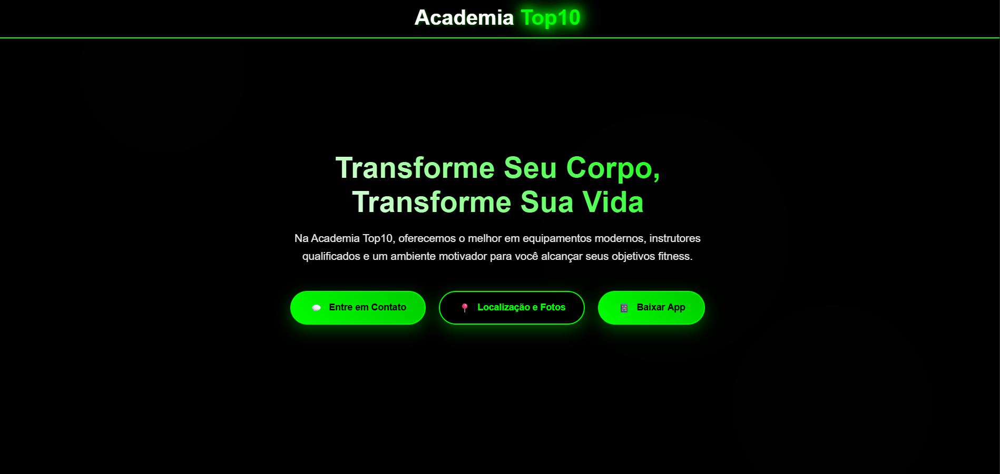
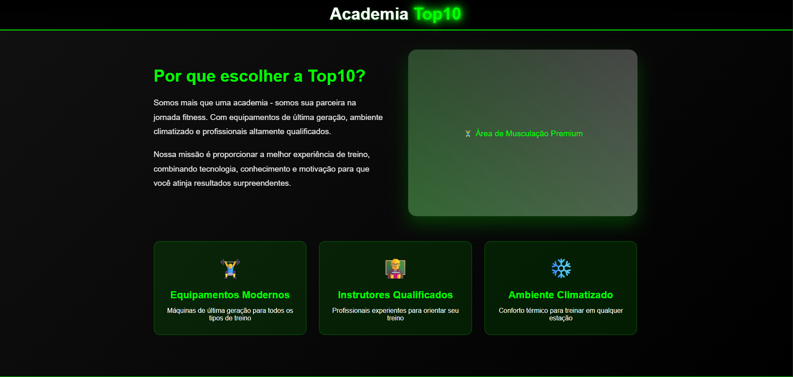

# 🏋️ siteAcademia

Site desenvolvido para uma academia, com foco em layout responsivo, design moderno e navegação simples.

## 📸 Prévia do Projeto




## 🚀 Tecnologias

- HTML5
- CSS3
- JavaScript (Vanilla)

## 🧪 Como rodar

1. Clone o repositório:
   ```bash
   git clone https://github.com/kaueheberle/siteAcademia.git
